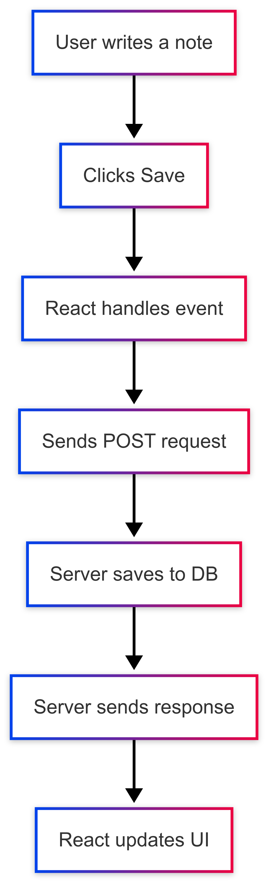

flowchart TD
  A[User writes a note] --> B["Clicks Save"]
  B --> C[React handles event]
  C --> D[Sends POST request]
  D --> E[Server saves to DB]
  E --> F[Server sends response]
  F --> G[React updates UI]
