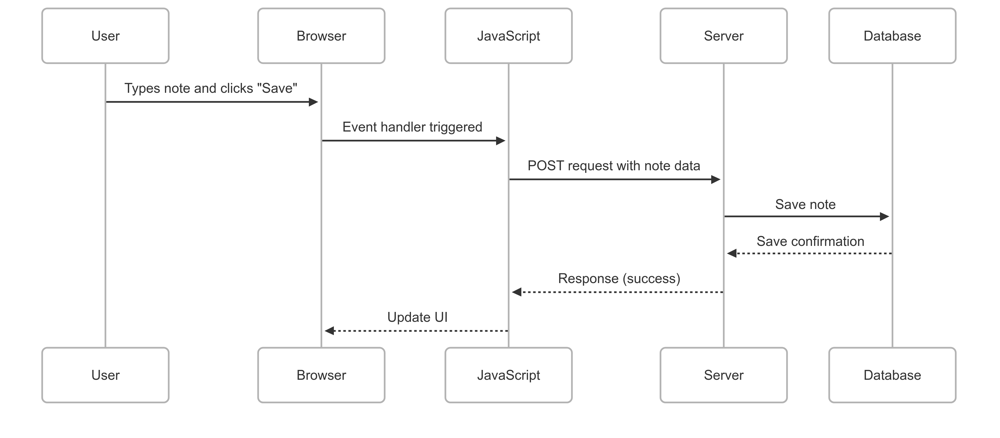

 
sequenceDiagram
  participant User
  participant Browser
  participant JavaScript
  participant Server
  participant Database

  User->>Browser: Types note and clicks "Save"
  Browser->>JavaScript: Event handler triggered
  JavaScript->>Server: POST request with note data
  Server->>Database: Save note
  Database-->>Server: Save confirmation
  Server-->>JavaScript: Response (success)
  JavaScript-->>Browser: Update UI
